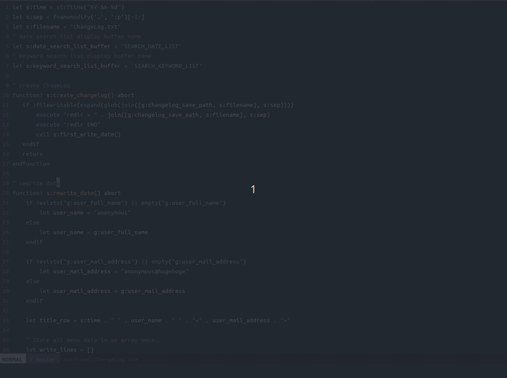
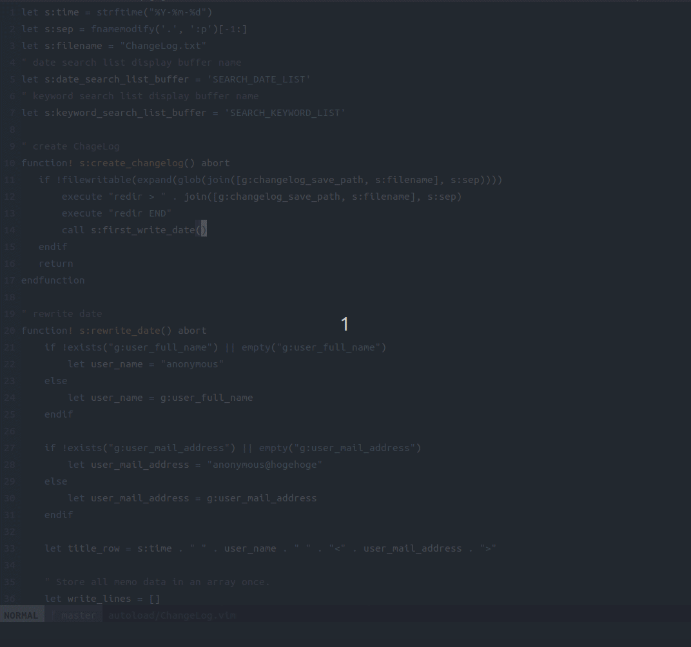
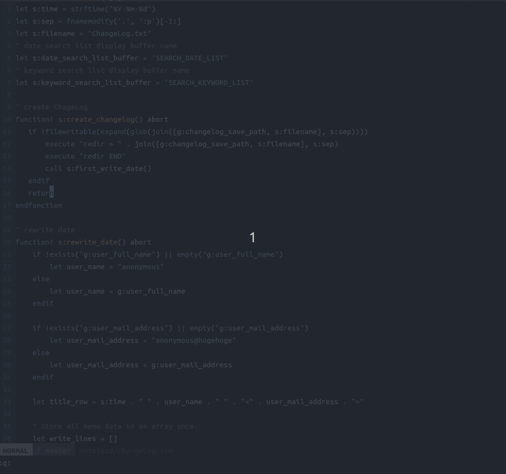

# vim-ChangeLog.vim
Memo plugin inspired by http://0xcc.net/unimag/1/ .   
Use it for everyday memos, development memos, etc.
# Requirement
・It works Vim. (Operation with NeoVim is currently being verified.)   
・It has the following features.

1. Create a new Changelog.txt file.
2. If a Changelog.txt file has been created, open it and insert the current date, name and email address.
3. Searching write date.
4. Searching keyword. (Only those lines with a leading \*.)

# Installation
This is an example of installation using vim-plug.
```
Plug 'jacoloves/vim-ChangeLog.vim'
```

Write the following parameters in vimrc.   
・Location for storing changelog memos.(required)
```
let g:changelog_save_path = [your changelog save path]
```

・Name to be set in changelog. (optional)   
    If no entry is made, it is written as *anonymous*.
```
let g:user_full_name = [your name]
```

・Mail address to be set in changelog. (optional)   
    If no entry is made, it is written as *anonymous@hogehoge*.
```
let g:user_mail_address = [your mail address]
```

# Usage
## :ChangeLogOpen
Create a new Changelog.txt file.   
If a Changelog.txt file has been created, open it and insert the current date, name and email address.   

## :SearchDateChaneLog
Searching write date.
Press enter to jump to the target date row.
Press 'q' to close the buffer.   

## :SearchKeywordChangeLog
Searching keyword. (Only those lines with a leading \*.)   
Press enter to jump to the target keyword row.
Press 'q' to close the buffer.   


# License
Distributed under MIT License. See LICENSE.
